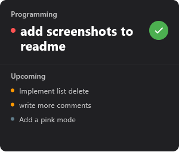
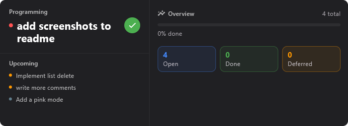
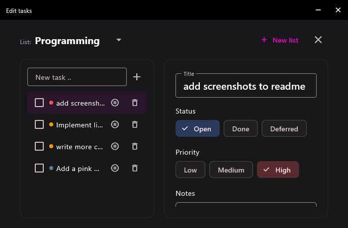
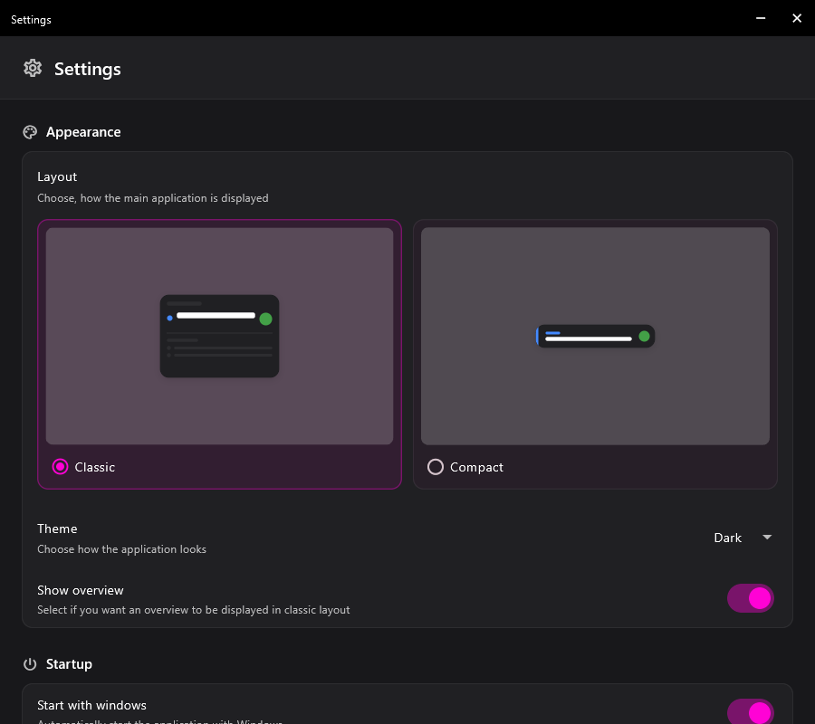
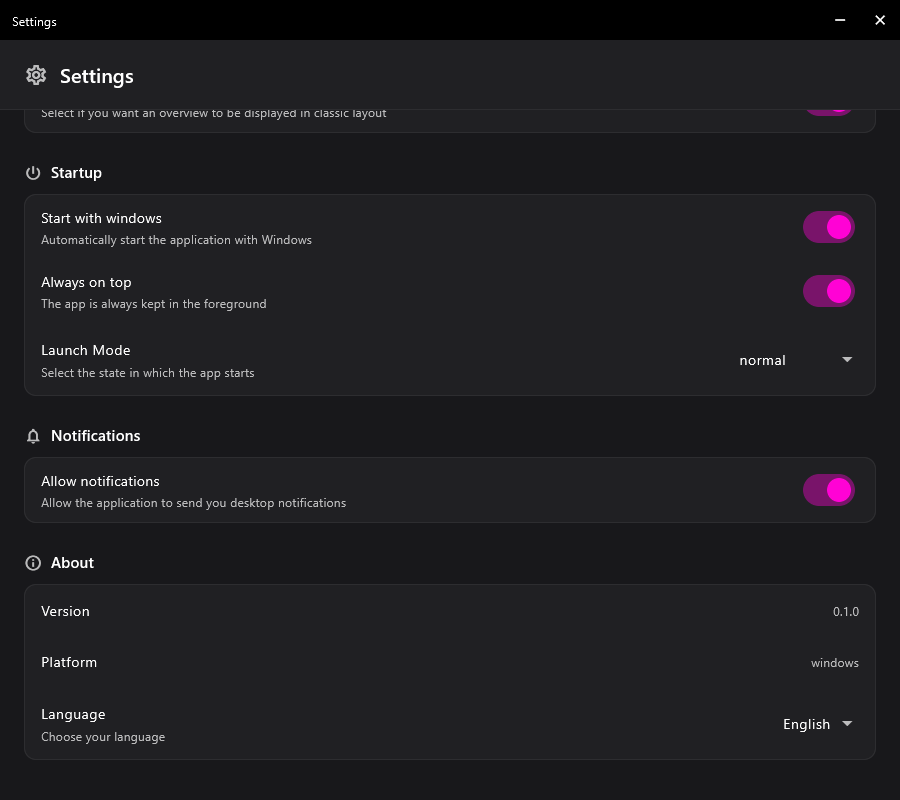
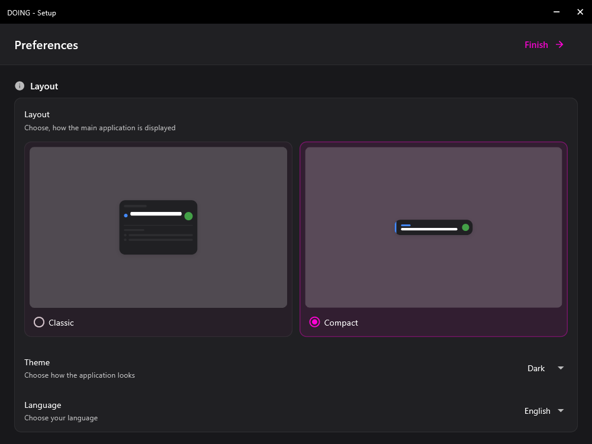

# Doing

A lightweight Windows desktop app (Flutter) for tracking to-dos. It lives as
a small, always-visible window on the desktop that can switch between
several views — from a tiny "current task" card up to a full editing view
with multiple lists.

## Screenshots

| Compact View                                          | Classic View                                                          | Classic View with overview                                                       |
| ----------------------------------------------------- | --------------------------------------------------------------------- | -------------------------------------------------------------------------------- |
|  |  |  |

| Edit View                                       | Settings                                           | Settings (more)                                             | Layout                                         |
| ----------------------------------------------- | -------------------------------------------------- | ----------------------------------------------------------- | ---------------------------------------------- |
|  |  |  |  |

## Views

- **Compact View** — the smallest form: just the active list's most
  important task, plus a "done" button. Tapping the task opens the edit
  view.
- **Classic View** — like Compact, but with a preview of the next upcoming
  tasks below it, and an optional KPI sidebar (open / done / deferred +
  progress bar) that can be toggled in settings.
- **Edit View** — full management: switch or create lists, add/delete
  tasks, edit title/notes/priority/status.
- **Settings / Layout** — theme, language, window size etc. (unchanged from
  the original app base).

Each view has its own fixed window size (`ScreenState` in
`lib/Models/screen_state_model.dart`); when the view changes, the window is
automatically resized to match via `window_manager`
(`lib/Controller/screen_state_controller.dart`).

## What was newly built in this project

The project was originally built for a different purpose and repurposed
into a to-do tracker. What's new is essentially the whole to-do feature:

1. **Data model & persistence** — `TodoData` / `TodoList` / `TodoItem` as a
   JSON file store (details below).
2. **State management** — `TodoNotifier` (Riverpod) with all actions
   (create list/task, change status/priority/notes, delete, switch active
   list) plus derived helper functions (current task, preview, count by
   status).
3. **Three redesigned views** (Compact, Classic, Edit) with a modern,
   uncluttered look and consistent signal colors throughout (blue = open,
   green = done, orange = deferred).
4. **Status concept** — instead of a simple done/not-done flag, there's now
   open / done / deferred, including backward-compatible JSON parsing for
   older saved data.
5. **Bugfixes along the way**: a dead edit button on an empty list, a
   render overflow on "deferred", and the edit view's resize bug

## How saving/loading lists and tasks works

All to-do data (every list, every task across all lists, and which list is
currently active) lives in **a single JSON file**:

```
<ApplicationSupportDirectory>/todos.json
```

(`getApplicationSupportDirectory()` from `path_provider` — on Windows that's
roughly `%APPDATA%/<App>/todos.json`.) This is the exact same pattern as the
already-existing `SettingsFileStore` for app settings — deliberately reused
so it behaves consistently with the rest of the app.

### File structure

```json
{
  "lists": [
    { "id": "...", "name": "Work", "created_at": "2026-09-20T10:00:00.000Z" }
  ],
  "items": [
    {
      "id": "...",
      "list_id": "...",
      "title": "Write invoice",
      "notes": "...",
      "priority": "high",
      "status": "open",
      "created_at": "2026-09-20T10:05:00.000Z",
      "completed_at": null
    }
  ],
  "active_list_id": "..."
}
```

- **`lists`** — all to-do lists (e.g. "Work", "Personal", …).
- **`items`** — _every_ task across _every_ list, in one flat array; each
  task carries its own `list_id` and belongs to exactly one list that way.
  This keeps the data structure simple, without lists and tasks having to
  be kept in sync across nested structures.
- **`active_list_id`** — which list is currently shown in Compact/Classic
  View. Updated whenever the list is switched (dropdown in the edit view).

Every task also has an `id` generated from a timestamp + random suffix
(`generateId()` in `lib/Helpers/parse_helper.dart`) — locally unique enough
without pulling in a UUID library as an extra dependency.

### Loading

On app start, `TodoStore.load()` (`lib/Services/todo_store.dart`) reads the
file:

- If it doesn't exist, or is empty/corrupted, a **default list** is created
  (translated name from the localization files) and saved right away — so
  there's never a state with zero lists.
- A read/parse error is **not** treated the same as "no data present" (that
  would otherwise let a transient failure overwrite real data with the
  default list) — it's logged and treated like a failed load, without
  touching the file.

The result lands in `todoProvider` (a Riverpod `AsyncNotifierProvider` in
`lib/Controller/todo_controller.dart`), which every view reads from
reactively.

### Saving

Every change (adding a task, setting a status, editing a note, creating a
list, …) goes through a central `_persist()` method on `TodoNotifier`:
Riverpod state is updated _and_ `TodoStore.save()` rewrites the entire file.

Writes are **atomic**:

1. The new data is first written to a `todos.json.tmp` file.
2. Only then is that temp file moved onto `todos.json` via `rename()`.

`rename()` is an atomic filesystem operation — so a concurrent read (e.g.
from another window of the app) can never observe a half-written file.
Notes are additionally saved with a **debounce** (600ms after the last
keystroke), so a file write isn't triggered on every character typed.

### Sorting / "current task"

There's no stored ordering — the display order is computed on every access
from priority + creation time (`openItemsSorted()` in
`todo_controller.dart`):

1. Only tasks with status `open` are eligible.
2. Primarily by priority (high → low).
3. On a tie, by creation time (oldest first).

The "current task" shown in Compact/Classic View is simply the first entry
of that list; the preview below it shows the next few after that.

## Project structure (relevant to the to-do feature)

```
lib/
  Models/
    todo_data_model.dart      # TodoData: lists + items + activeListId, JSON (de)serialization
    todo_item_model.dart      # TodoItem: a single task
    todo_list_model.dart      # TodoList: a single list
    screen_state_model.dart   # window sizes per view
  Extensions/
    todo_priority_extension.dart  # low/medium/high: label + color
    todo_status_extension.dart    # open/done/deferred: label + color
  Controller/
    todo_controller.dart      # TodoNotifier (Riverpod) + derived helper functions
    screen_state_controller.dart  # controls window size per view
  Services/
    todo_store.dart           # loading/saving todos.json
  Screens/
    compact_view.dart
    classic_view.dart
    edit_view.dart
  Widgets/
    sorting_card.dart         # compact stat tile (open/done/deferred)
```

## Setup

```
flutter pub get
flutter run -d windows
```
